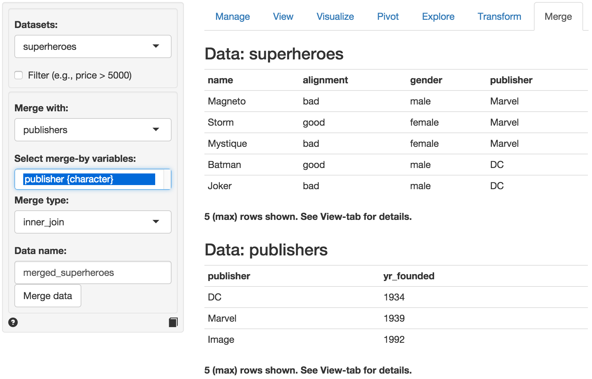
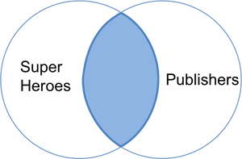
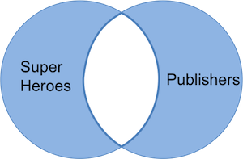

> Merge (join) two datasets

There are four merge options available in Radiant from the [dplyr](http://www.rdocumentation.org/packages/dplyr) package developed by Hadley Wickham and Romain Francois on [GitHub](https://github.com/hadley/dplyr).

We will use two small datasets, `superheroes` and `publishers`, created by Jenny Bryan to illustrate the different merge / join types (see source information below).


<table width='100%'>
<caption>Superheroes</caption>
 <thead>
  <tr>
   <th style="text-align:left;"> name </th>
   <th style="text-align:left;"> alignment </th>
   <th style="text-align:left;"> gender </th>
   <th style="text-align:left;"> publisher </th>
  </tr>
 </thead>
<tbody>
  <tr>
   <td style="text-align:left;"> Magneto </td>
   <td style="text-align:left;"> bad </td>
   <td style="text-align:left;"> male </td>
   <td style="text-align:left;"> Marvel </td>
  </tr>
  <tr>
   <td style="text-align:left;"> Storm </td>
   <td style="text-align:left;"> good </td>
   <td style="text-align:left;"> female </td>
   <td style="text-align:left;"> Marvel </td>
  </tr>
  <tr>
   <td style="text-align:left;"> Mystique </td>
   <td style="text-align:left;"> bad </td>
   <td style="text-align:left;"> female </td>
   <td style="text-align:left;"> Marvel </td>
  </tr>
  <tr>
   <td style="text-align:left;"> Batman </td>
   <td style="text-align:left;"> good </td>
   <td style="text-align:left;"> male </td>
   <td style="text-align:left;"> DC </td>
  </tr>
  <tr>
   <td style="text-align:left;"> Joker </td>
   <td style="text-align:left;"> bad </td>
   <td style="text-align:left;"> male </td>
   <td style="text-align:left;"> DC </td>
  </tr>
  <tr>
   <td style="text-align:left;"> Catwoman </td>
   <td style="text-align:left;"> bad </td>
   <td style="text-align:left;"> female </td>
   <td style="text-align:left;"> DC </td>
  </tr>
  <tr>
   <td style="text-align:left;"> Hellboy </td>
   <td style="text-align:left;"> good </td>
   <td style="text-align:left;"> male </td>
   <td style="text-align:left;"> Dark Horse Comics </td>
  </tr>
</tbody>
</table>

<br>

<table width='50%'>
<caption>Publishers</caption>
 <thead>
  <tr>
   <th style="text-align:left;"> publisher </th>
   <th style="text-align:left;"> yr_founded </th>
  </tr>
 </thead>
<tbody>
  <tr>
   <td style="text-align:left;"> DC </td>
   <td style="text-align:left;"> 1934 </td>
  </tr>
  <tr>
   <td style="text-align:left;"> Marvel </td>
   <td style="text-align:left;"> 1939 </td>
  </tr>
  <tr>
   <td style="text-align:left;"> Image </td>
   <td style="text-align:left;"> 1992 </td>
  </tr>
</tbody>
</table>

<br>

In the screen-shot of the Data > Merge tab below we see the two datasets. The tables share variable `publisher` that is automatically select for the merge / join. There are different ways to merge / join the data that we will discuss below.



<br>

### Inner join (superheroes, publishers)

> An inner join return all rows from x with matching values in y, and all columns from both x and y. If there are multiple matches between x and y, all match combinations are returned.

<table width='100%'>
 <thead>
  <tr>
   <th style="text-align:left;"> name </th>
   <th style="text-align:left;"> alignment </th>
   <th style="text-align:left;"> gender </th>
   <th style="text-align:left;"> publisher </th>
   <th style="text-align:left;"> yr_founded </th>
  </tr>
 </thead>
<tbody>
  <tr>
   <td style="text-align:left;"> Magneto </td>
   <td style="text-align:left;"> bad </td>
   <td style="text-align:left;"> male </td>
   <td style="text-align:left;"> Marvel </td>
   <td style="text-align:left;"> 1939 </td>
  </tr>
  <tr>
   <td style="text-align:left;"> Storm </td>
   <td style="text-align:left;"> good </td>
   <td style="text-align:left;"> female </td>
   <td style="text-align:left;"> Marvel </td>
   <td style="text-align:left;"> 1939 </td>
  </tr>
  <tr>
   <td style="text-align:left;"> Mystique </td>
   <td style="text-align:left;"> bad </td>
   <td style="text-align:left;"> female </td>
   <td style="text-align:left;"> Marvel </td>
   <td style="text-align:left;"> 1939 </td>
  </tr>
  <tr>
   <td style="text-align:left;"> Batman </td>
   <td style="text-align:left;"> good </td>
   <td style="text-align:left;"> male </td>
   <td style="text-align:left;"> DC </td>
   <td style="text-align:left;"> 1934 </td>
  </tr>
  <tr>
   <td style="text-align:left;"> Joker </td>
   <td style="text-align:left;"> bad </td>
   <td style="text-align:left;"> male </td>
   <td style="text-align:left;"> DC </td>
   <td style="text-align:left;"> 1934 </td>
  </tr>
  <tr>
   <td style="text-align:left;"> Catwoman </td>
   <td style="text-align:left;"> bad </td>
   <td style="text-align:left;"> female </td>
   <td style="text-align:left;"> DC </td>
   <td style="text-align:left;"> 1934 </td>
  </tr>
</tbody>
</table>

<br>

In the table above we lose _Hellboy_ because, although this hero does appear in `superheroes`, the publisher (_Dark Horse Comics_) does not appear in `publishers`. The join result has all variables from `superheroes`, plus _yr\_founded_, from `publishers`. We can visualize an inner join with the venn-diagram below:



Notice that a join can change the row and variable order so you should not rely on these in an analysis. The command that Radiant uses internally is:

```r
mergedata(dataset = "superheroes", dataset2 = "publishers", merge_vars = "publisher", merge_type = "left_join", merge_name = "merged_superheroes")
```

The same result can be achieved with the following R-code:

```r
merged_superheroes <- inner_join(superheroes, publishers, by = "publisher")
```

<br>

### Semi join (superheroes, publishers)

> A semi join keeps only columns from x. Whereas an inner join will return one row of x for each matching row of y, a semi join will never duplicate rows of x.

<table width='100%'>
 <thead>
  <tr>
   <th style="text-align:left;"> name </th>
   <th style="text-align:left;"> alignment </th>
   <th style="text-align:left;"> gender </th>
   <th style="text-align:left;"> publisher </th>
  </tr>
 </thead>
<tbody>
  <tr>
   <td style="text-align:left;"> Batman </td>
   <td style="text-align:left;"> good </td>
   <td style="text-align:left;"> male </td>
   <td style="text-align:left;"> DC </td>
  </tr>
  <tr>
   <td style="text-align:left;"> Joker </td>
   <td style="text-align:left;"> bad </td>
   <td style="text-align:left;"> male </td>
   <td style="text-align:left;"> DC </td>
  </tr>
  <tr>
   <td style="text-align:left;"> Catwoman </td>
   <td style="text-align:left;"> bad </td>
   <td style="text-align:left;"> female </td>
   <td style="text-align:left;"> DC </td>
  </tr>
  <tr>
   <td style="text-align:left;"> Magneto </td>
   <td style="text-align:left;"> bad </td>
   <td style="text-align:left;"> male </td>
   <td style="text-align:left;"> Marvel </td>
  </tr>
  <tr>
   <td style="text-align:left;"> Storm </td>
   <td style="text-align:left;"> good </td>
   <td style="text-align:left;"> female </td>
   <td style="text-align:left;"> Marvel </td>
  </tr>
  <tr>
   <td style="text-align:left;"> Mystique </td>
   <td style="text-align:left;"> bad </td>
   <td style="text-align:left;"> female </td>
   <td style="text-align:left;"> Marvel </td>
  </tr>
</tbody>
</table>

<br>

We get a similar table as with `inner_join` but it contains only the variables in `superheroes`. The command that Radiant uses internally is:

```r
mergedata(dataset = "superheroes", dataset2 = "publishers", merge_vars = "publisher", merge_type = "semi_join", merge_name = "merged_superheroes")
```

The same result can be achieved with the following R-code:

```r
merged_superheroes <- semi_join(superheroes, publishers, by = "publisher")
```

<br>

### Left join (superheroes, publishers)

> A left join returns all rows from x, and all columns from x and y. If there are multiple matches between x and y, all match combinations are returned.

<table width='100%'>
 <thead>
  <tr>
   <th style="text-align:left;"> name </th>
   <th style="text-align:left;"> alignment </th>
   <th style="text-align:left;"> gender </th>
   <th style="text-align:left;"> publisher </th>
   <th style="text-align:left;"> yr_founded </th>
  </tr>
 </thead>
<tbody>
  <tr>
   <td style="text-align:left;"> Magneto </td>
   <td style="text-align:left;"> bad </td>
   <td style="text-align:left;"> male </td>
   <td style="text-align:left;"> Marvel </td>
   <td style="text-align:left;"> 1939 </td>
  </tr>
  <tr>
   <td style="text-align:left;"> Storm </td>
   <td style="text-align:left;"> good </td>
   <td style="text-align:left;"> female </td>
   <td style="text-align:left;"> Marvel </td>
   <td style="text-align:left;"> 1939 </td>
  </tr>
  <tr>
   <td style="text-align:left;"> Mystique </td>
   <td style="text-align:left;"> bad </td>
   <td style="text-align:left;"> female </td>
   <td style="text-align:left;"> Marvel </td>
   <td style="text-align:left;"> 1939 </td>
  </tr>
  <tr>
   <td style="text-align:left;"> Batman </td>
   <td style="text-align:left;"> good </td>
   <td style="text-align:left;"> male </td>
   <td style="text-align:left;"> DC </td>
   <td style="text-align:left;"> 1934 </td>
  </tr>
  <tr>
   <td style="text-align:left;"> Joker </td>
   <td style="text-align:left;"> bad </td>
   <td style="text-align:left;"> male </td>
   <td style="text-align:left;"> DC </td>
   <td style="text-align:left;"> 1934 </td>
  </tr>
  <tr>
   <td style="text-align:left;"> Catwoman </td>
   <td style="text-align:left;"> bad </td>
   <td style="text-align:left;"> female </td>
   <td style="text-align:left;"> DC </td>
   <td style="text-align:left;"> 1934 </td>
  </tr>
  <tr>
   <td style="text-align:left;"> Hellboy </td>
   <td style="text-align:left;"> good </td>
   <td style="text-align:left;"> male </td>
   <td style="text-align:left;"> Dark Horse Comics </td>
   <td style="text-align:left;"> NA </td>
  </tr>
</tbody>
</table>

<br>

We result table contains `superheroes` with variable `yr_founded` from `publishers`. _Hellboy_, whose publisher does not appear in `publishers`, has an `NA` for _yr_founded_. We can visualize a left join with the venn-diagram below:


The command that Radiant uses internally is:

```r
mergedata(dataset = "superheroes", dataset2 = "publishers", merge_vars = "publisher", merge_type = "semi_join", merge_name = "merged_superheroes")
```

The same result can be achieved with the following R-code:

```r
merged_superheroes <- semi_join(superheroes, publishers, by = "publisher")
```

<br>

### Anti join (superheroes, publishers)

> An anti join returns all rows from x without matching values in y, keeping only columns from x

<table width='100%'>
 <thead>
  <tr>
   <th style="text-align:left;"> name </th>
   <th style="text-align:left;"> alignment </th>
   <th style="text-align:left;"> gender </th>
   <th style="text-align:left;"> publisher </th>
  </tr>
 </thead>
<tbody>
  <tr>
   <td style="text-align:left;"> Hellboy </td>
   <td style="text-align:left;"> good </td>
   <td style="text-align:left;"> male </td>
   <td style="text-align:left;"> Dark Horse Comics </td>
  </tr>
</tbody>
</table>

<br>

We now get **only** _Hellboy_ and we do not get the variable _yr\_founded_. We can visualize an anti join with the venn-diagram below:



<br>

### Dataset order

Note that the order of the datasets matters for semi, left, and anti join. If we setup the Data > Merge tab as below the results are as follow:


<br>

### Inner join (publishers, superheroes)

<table width='100%'>
 <thead>
  <tr>
   <th style="text-align:left;"> publisher </th>
   <th style="text-align:left;"> yr_founded </th>
   <th style="text-align:left;"> name </th>
   <th style="text-align:left;"> alignment </th>
   <th style="text-align:left;"> gender </th>
  </tr>
 </thead>
<tbody>
  <tr>
   <td style="text-align:left;"> DC </td>
   <td style="text-align:left;"> 1934 </td>
   <td style="text-align:left;"> Batman </td>
   <td style="text-align:left;"> good </td>
   <td style="text-align:left;"> male </td>
  </tr>
  <tr>
   <td style="text-align:left;"> DC </td>
   <td style="text-align:left;"> 1934 </td>
   <td style="text-align:left;"> Joker </td>
   <td style="text-align:left;"> bad </td>
   <td style="text-align:left;"> male </td>
  </tr>
  <tr>
   <td style="text-align:left;"> DC </td>
   <td style="text-align:left;"> 1934 </td>
   <td style="text-align:left;"> Catwoman </td>
   <td style="text-align:left;"> bad </td>
   <td style="text-align:left;"> female </td>
  </tr>
  <tr>
   <td style="text-align:left;"> Marvel </td>
   <td style="text-align:left;"> 1939 </td>
   <td style="text-align:left;"> Magneto </td>
   <td style="text-align:left;"> bad </td>
   <td style="text-align:left;"> male </td>
  </tr>
  <tr>
   <td style="text-align:left;"> Marvel </td>
   <td style="text-align:left;"> 1939 </td>
   <td style="text-align:left;"> Storm </td>
   <td style="text-align:left;"> good </td>
   <td style="text-align:left;"> female </td>
  </tr>
  <tr>
   <td style="text-align:left;"> Marvel </td>
   <td style="text-align:left;"> 1939 </td>
   <td style="text-align:left;"> Mystique </td>
   <td style="text-align:left;"> bad </td>
   <td style="text-align:left;"> female </td>
  </tr>
</tbody>
</table>

<br>

Every publisher that has a match in `superheroes` appears multiple times, once for each match. Apart from variable order, this is the same result we had above.

<br>

### Semi join (publishers, superheroes)

<table width='50%'>
 <thead>
  <tr>
   <th style="text-align:left;"> publisher </th>
   <th style="text-align:left;"> yr_founded </th>
  </tr>
 </thead>
<tbody>
  <tr>
   <td style="text-align:left;"> Marvel </td>
   <td style="text-align:left;"> 1939 </td>
  </tr>
  <tr>
   <td style="text-align:left;"> DC </td>
   <td style="text-align:left;"> 1934 </td>
  </tr>
</tbody>
</table>

<br>

With semi join the effect of switching the dataset order is more clear. Even though there are multiple matches for each publisher only one is shown. Publisher _Image_ is lost, because it is not in `superheroes`.

<br>

### Left join (publishers, superheroes)

<table width='100%'>
 <thead>
  <tr>
   <th style="text-align:left;"> publisher </th>
   <th style="text-align:left;"> yr_founded </th>
   <th style="text-align:left;"> name </th>
   <th style="text-align:left;"> alignment </th>
   <th style="text-align:left;"> gender </th>
  </tr>
 </thead>
<tbody>
  <tr>
   <td style="text-align:left;"> DC </td>
   <td style="text-align:left;"> 1934 </td>
   <td style="text-align:left;"> Batman </td>
   <td style="text-align:left;"> good </td>
   <td style="text-align:left;"> male </td>
  </tr>
  <tr>
   <td style="text-align:left;"> DC </td>
   <td style="text-align:left;"> 1934 </td>
   <td style="text-align:left;"> Joker </td>
   <td style="text-align:left;"> bad </td>
   <td style="text-align:left;"> male </td>
  </tr>
  <tr>
   <td style="text-align:left;"> DC </td>
   <td style="text-align:left;"> 1934 </td>
   <td style="text-align:left;"> Catwoman </td>
   <td style="text-align:left;"> bad </td>
   <td style="text-align:left;"> female </td>
  </tr>
  <tr>
   <td style="text-align:left;"> Marvel </td>
   <td style="text-align:left;"> 1939 </td>
   <td style="text-align:left;"> Magneto </td>
   <td style="text-align:left;"> bad </td>
   <td style="text-align:left;"> male </td>
  </tr>
  <tr>
   <td style="text-align:left;"> Marvel </td>
   <td style="text-align:left;"> 1939 </td>
   <td style="text-align:left;"> Storm </td>
   <td style="text-align:left;"> good </td>
   <td style="text-align:left;"> female </td>
  </tr>
  <tr>
   <td style="text-align:left;"> Marvel </td>
   <td style="text-align:left;"> 1939 </td>
   <td style="text-align:left;"> Mystique </td>
   <td style="text-align:left;"> bad </td>
   <td style="text-align:left;"> female </td>
  </tr>
  <tr>
   <td style="text-align:left;"> Image </td>
   <td style="text-align:left;"> 1992 </td>
   <td style="text-align:left;"> NA </td>
   <td style="text-align:left;"> NA </td>
   <td style="text-align:left;"> NA </td>
  </tr>
</tbody>
</table>

<br>

As before, we get first dataset back (here `publishers`) but not with added variables from `superheroes` dataset. Note that, in contrast to the inner join, publisher _Image_ survives, even though no superheroes from _Image_ appear in `superheroes`. As a result, _Image_ has NAs for variables _name_, _alignment_, and _gender_.

<br>

### Anti join (publishers, superheroes)

<table width='50%'>
 <thead>
  <tr>
   <th style="text-align:left;"> publisher </th>
   <th style="text-align:left;"> yr_founded </th>
  </tr>
 </thead>
<tbody>
  <tr>
   <td style="text-align:left;"> Image </td>
   <td style="text-align:left;"> 1992 </td>
  </tr>
</tbody>
</table>

<br>

Only publisher _Image_ is retained now and all variables in `publishers`.

<br>

### Outer join (publishers, superheroes)

An outer join combines two data.frames, keeping rows and columns that appear in either. Note that this join is not currently available in _dplyr_.

<table width='100%'>
 <thead>
  <tr>
   <th style="text-align:left;"> publisher </th>
   <th style="text-align:left;"> yr_founded </th>
   <th style="text-align:left;"> name </th>
   <th style="text-align:left;"> alignment </th>
   <th style="text-align:left;"> gender </th>
  </tr>
 </thead>
<tbody>
  <tr>
   <td style="text-align:left;"> Dark Horse Comics </td>
   <td style="text-align:left;"> NA </td>
   <td style="text-align:left;"> Hellboy </td>
   <td style="text-align:left;"> good </td>
   <td style="text-align:left;"> male </td>
  </tr>
  <tr>
   <td style="text-align:left;"> DC </td>
   <td style="text-align:left;"> 1934 </td>
   <td style="text-align:left;"> Batman </td>
   <td style="text-align:left;"> good </td>
   <td style="text-align:left;"> male </td>
  </tr>
  <tr>
   <td style="text-align:left;"> DC </td>
   <td style="text-align:left;"> 1934 </td>
   <td style="text-align:left;"> Joker </td>
   <td style="text-align:left;"> bad </td>
   <td style="text-align:left;"> male </td>
  </tr>
  <tr>
   <td style="text-align:left;"> DC </td>
   <td style="text-align:left;"> 1934 </td>
   <td style="text-align:left;"> Catwoman </td>
   <td style="text-align:left;"> bad </td>
   <td style="text-align:left;"> female </td>
  </tr>
  <tr>
   <td style="text-align:left;"> Image </td>
   <td style="text-align:left;"> 1992 </td>
   <td style="text-align:left;"> NA </td>
   <td style="text-align:left;"> NA </td>
   <td style="text-align:left;"> NA </td>
  </tr>
  <tr>
   <td style="text-align:left;"> Marvel </td>
   <td style="text-align:left;"> 1939 </td>
   <td style="text-align:left;"> Magneto </td>
   <td style="text-align:left;"> bad </td>
   <td style="text-align:left;"> male </td>
  </tr>
  <tr>
   <td style="text-align:left;"> Marvel </td>
   <td style="text-align:left;"> 1939 </td>
   <td style="text-align:left;"> Storm </td>
   <td style="text-align:left;"> good </td>
   <td style="text-align:left;"> female </td>
  </tr>
  <tr>
   <td style="text-align:left;"> Marvel </td>
   <td style="text-align:left;"> 1939 </td>
   <td style="text-align:left;"> Mystique </td>
   <td style="text-align:left;"> bad </td>
   <td style="text-align:left;"> female </td>
  </tr>
</tbody>
</table>

<br>

In this table we keep _Hellboy_ (even though _Dark Horse Comics_ is not in `publishers`) and _Image_ (even though the publisher is not listed in `superheroes`) and get variables from both datasets. Observations without a match are assigned the value NA for variables from the _other_ dataset. We can visualize an outer join with the venn-diagram below:


The command that Radiant uses internally is:

```r
mergedata(dataset = "publishers", dataset2 = "superheroes", merge_vars = "publisher", merge_type = "outer_join", merge_name = "merged_superheroes")
```

The same result can be achieved with the following R-code:

```r
merged_superheroes <- merge(superheroes, publishers, by = "publisher", all = TRUE)
```

or if you have the Radiant library loaded with:

```r
merged_superheroes <- outer_join(superheroes, publishers, by = "publisher")
```

---------------
Based on [Cheatsheet for dplyr join functions](http://stat545-ubc.github.io/bit001_dplyr-cheatsheet.html) by Jenny Bryan
